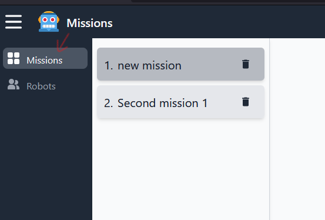
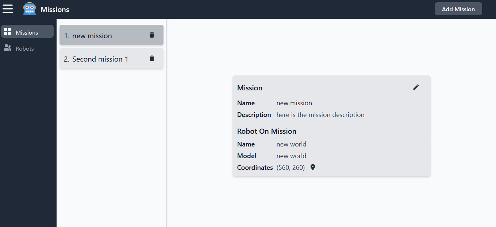
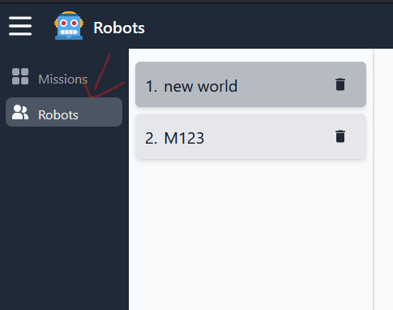
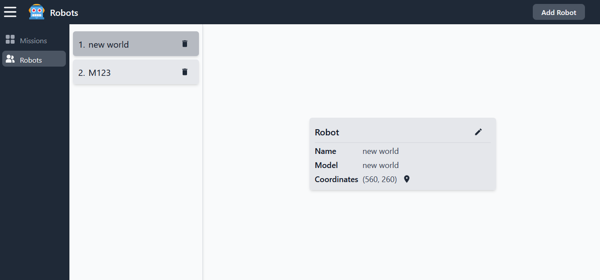
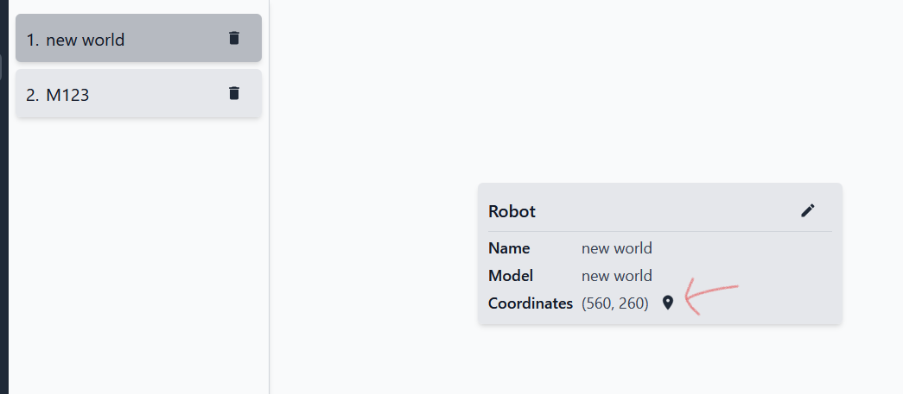
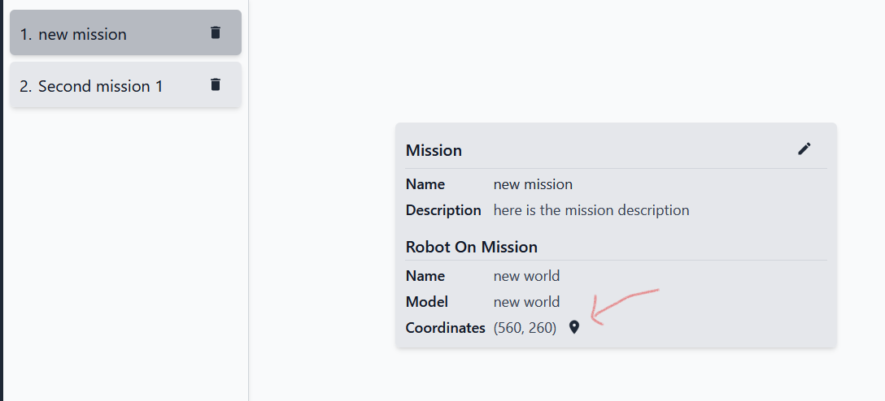
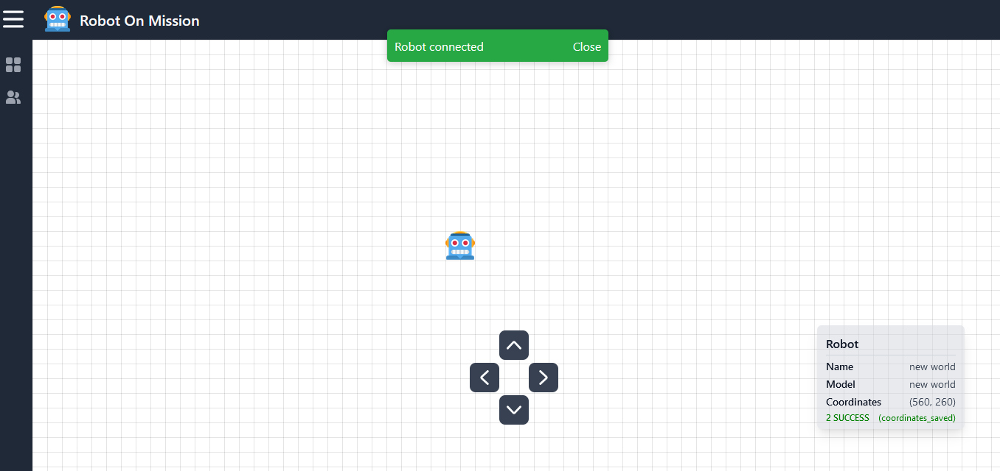

# Robot on Mission (React Project)

## While using below link you may get warning for ssl certificate but you can accept it as I have used openssl for demonstration purpose

### If you are using below link for apis please add api as base route eg: ```<aws-url>/api/<route>```

Live Link is removed now.

- Vite-React frontend project.
- Tailwind for CSS classes.
- Redux-Toolkit for state management.
- Axios for HTTP REST API calls.
- React-Router-Dom for routing.
- WebSocket for websocket connection.
- Eslint for lint check and fix.
- Host on AWS ec2, by config Nginx.

## Before starting further please run npm install and add a /.env with required envs as shown in /.env.example

    (Install npm packages)
    npm i / install

    (Add /.env with required envs from /.env.example file)

    (Run a dev instance)
    npm run dev

    (Run a lint check)
    npm run lint

## Project has 3 modules

- Mission
- Robot
- Teleoperation

### Mission

- Mission module contains UI for CRUD REST APIs for missions.
- You can navigate from side bar to missions page or home page is the missions page itself.
  
  

### Robot

- Robot module contains UI for CRUD REST APIs for robot.
- You can navigate from side bar to robots page.
  
  

### Tele-operation

- Tele-operation module contains UI tele-operating a robot on the screen using a joystick button control and push the coordinates to the backend using websocket connection.
- To navigate to tele-operate you need to either view a robot details or need to view a mission details and there in the coordinates line you will find location icon that will navigate the selected robot to tele-operate.
  
  
  
